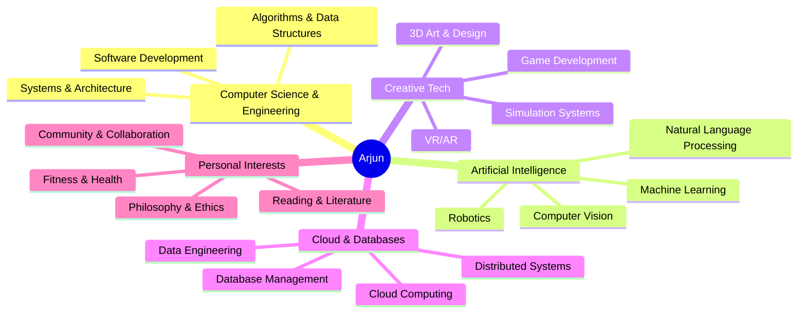

# 🌟 Arjun Sharma

### 👨‍💻 Software Engineer × 🧠 Machine Learning Engineer

*Building one thought at a time*

---

## 🛠️ Tech Arsenal

| 💻 Programming Languages | ⚡ Frameworks & Libraries |
| ------------------------- | ------------------------- |
|        |      |

| ☁️ Cloud & Databases | 🛠️ Tools & Testing |
| -------------------- | ------------------- |
|        |            |

---

## 📊 GitHub Analytics

<table>
<tr>
<td width="50%">

 

</td>
<td width="50%">

</td>
</tr>
</table>

---

## 🌟 Professional Focus Areas

### 💌 Let's Build Something Amazing Together!

  

